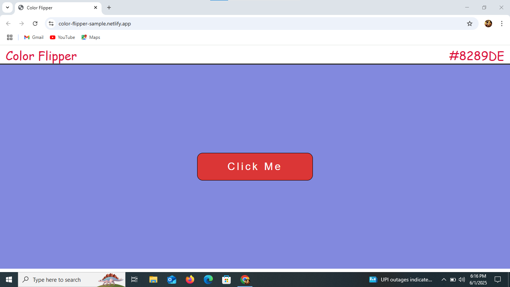

# Color Flipper

A simple and fun web application that changes the background color to a random HEX value when a button is clicked.

🔗 **Live Demo**: [Click Here to Visit](https://color-flipper-sample.netlify.app/)

## Developed By
**Gayathri G**  

GitHub: [GAYATHRI1006](https://github.com/GAYATHRI1006)

## Features

- Random background color generation on button click  
- Displays the HEX color code at the top-right corner  
- Minimal and clean UI using HTML, CSS, and JavaScript

## Technologies Used

- **HTML5**  
- **CSS3**  
- **JavaScript **

## Screenshot

## How It Works

1. On button click, a random HEX color code is generated.
2. The background color of the page changes to the generated color.
3. The HEX value is also displayed at the top-right of the screen.

## How to Run

1. Download or clone this repository.  
2. Open the `index.html` file in any web browser.  
3. Click the **"Click Me"** button to see the background color change.

